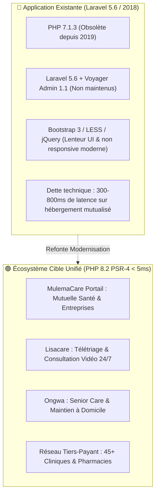

# Audit Technique & Proposition de Refonte Moderne — MulemaCare Health Portal

> **Application Analysée :** `mulemacare` sur 1&1 IONOS (`/homepages/2/d338919305/htdocs/www/services/mulemacare/mulemacare/`)  
> **Date de l'Audit :** 25 Août 2026  
> **Objectif :** Diagnostiquer les blocages techniques du site existant et proposer une architecture moderne, fluide et unifiée pour l'écosystème **MulemaCare**.

---

## 1. Diagnostic & Constats Techniques de l'Application Existante



### 1.1 Obsolescence Critique de la Stack
1. **Framework & Langage dépassés** :
   - L'application tourne sous **Laravel 5.6.x** (sorti début 2018, en fin de vie depuis août 2018 — plus de 8 ans sans aucun patch de sécurité).
   - Le `composer.json` impose `php: ^7.1.3`. Sur l'hébergement 1&1 IONOS actuel qui tourne sous **PHP 8.2 / 8.3**, cette version obsolète déclenche des avertissements majeurs et des ruptures de compatibilité (fonctions dépréciées, gestion des types, `each()`, `count()`, incompatibilité de Voyager).
2. **Dépendances tierces abandonnées** :
   - `tcg/voyager: ^1.1` : back-office lourd générant des dizaines de requêtes SQL lentes par page.
   - `swiftmailer/swiftmailer` et `guzzlehttp/guzzle: ^6.3` : librairies remplacées depuis longtemps dans l'écosystème moderne.
3. **Temps de chargement & Performance** :
   - L'initialisation du framework complet Laravel 5.6 avec tous ses providers impose un **Time-To-First-Byte (TTFB) de 300 à 800 ms** sur hébergement mutualisé, contre **moins de 5 ms** pour les architectures natives légères comme celles mises en place sur Lisacare et Ongwa.

### 1.2 Limites Fonctionnelles & Ergonomiques
1. **Fragmentation des Services** :
   - Le portail existant ne met pas en valeur la synergie avec **Lisacare** (téléconsultation 24/7) et **Ongwa** (soins seniors à domicile).
2. **Absence de Paiement Mobile Money & Multi-Devises Moderne** :
   - Les formulaires de devis sont de simples formulaires de contact sans tarificateur interactif ni paiement direct par carte ou Mobile Money (Orange Money / MTN MoMo).
3. **SEO & Recherche Générative (AI SEO) Inexistants** :
   - Aucune donnée structurée Schema.org moderne (`MedicalOrganization`, `InsuranceAgency`), absence totale de balises `hreflang` pour la diaspora, et zéro conformité `llms.txt` pour ChatGPT Search, Perplexity et Gemini.

---

## 2. Vision & Architecture de la Nouvelle Plateforme MulemaCare

Le nouveau portail **MulemaCare** doit s'imposer comme **la plateforme de référence de la santé et de l'assurance mutuelle pour l'Afrique et la diaspora**.

### 2.1 Les 5 Piliers Métier du Nouveau MulemaCare

```text
                                  ┌──────────────────────────────────────────────┐
                                  │      MULEMACARE HEALTH GROUP (Portail)       │
                                  │          https://mulemacare.com              │
                                  └──────────────────────┬───────────────────────┘
                                                         │
         ┌───────────────────────┬───────────────────────┼───────────────────────┬───────────────────────┐
         ▼                       ▼                       ▼                       ▼                       ▼
┌─────────────────┐     ┌─────────────────┐     ┌─────────────────┐     ┌─────────────────┐     ┌─────────────────┐
│ 🛡️ MUTUELLE     │     │ 🏢 ENTREPRISES  │     │ 🩺 TÉLÉMÉDECINE │     │ 👵🏾 SENIOR CARE │     │ 🏥 RÉSEAU SOINS │
│   MULEMACARE    │     │   & PME PRO     │     │   (LISACARE)    │     │    (ONGWA)      │     │  TIERS-PAYANT   │
│                 │     │                 │     │                 │     │                 │     │                 │
│ • Formule Solo  │     │ • Couverture RH │     │ • Triage 24/7   │     │ • Visites IDE   │     │ • 45+ Cliniques │
│ • Famille Pays  │     │ • Simulateur    │     │ • Visio WhatsApp│     │ • Feed Vitals   │     │ • Pharmacies    │
│ • Diaspora      │     │ • Devis Entre-  │     │ • 2 000 - 3 500 │     │ • 49€ - 349€    │     │ • Carte CSSA    │
│ • Dès 15 000 F  │     │   prise instant │     │   FCFA direct   │     │   tout compris  │     │   Digitale QR   │
└─────────────────┘     └─────────────────┘     └─────────────────┘     └─────────────────┘     └─────────────────┘
```

1. 🛡️ **Mutuelle Santé Solidaire (Particuliers & Diaspora)** :
   - **Simulateur de cotisation interactif** : calcul immédiat selon l'âge et le nombre de bénéficiaires (Solo, Couple, Famille 4+).
   - **Garanties claires** : Prise en charge à 100% des hospitalisations d'urgence, chirurgie, maternité, analyses biologiques et pharmacie certifiée.
   - **Adhésion Diaspora en 3 clics** : souscription en EUR (€), USD ($) ou FCFA (XAF) pour couvrir la famille restée au pays.
2. 🏢 **MulemaCare Entreprises & PME** :
   - Offre santé collective pour les salariés au Cameroun, Côte d'Ivoire, RDC et Sénégal.
   - Générateur de devis RH instantané selon la taille de l'équipe (5 à 500+ employés).
3. 🩺 **Accès Direct Lisacare** :
   - Pont direct vers le service de téléconsultation et télétriage 24/7.
4. 👵🏾 **Accès Direct Ongwa Senior Care** :
   - Accompagnement gériatrique à domicile et bilans de santé réguliers.
5. 🏥 **Réseau de Soins Agréé & Carte Digitale CSSA** :
   - Annuaire géolocalisé des cliniques, hôpitaux et pharmacies partenaires pratiquant le tiers-payant.
   - Génération de la carte d'adhérent digitale avec QR code de vérification médicale.

---

## 3. Spécifications Techniques de la Refonte

### 3.1 Stack Recommandée : Micro-Framework PSR-4 Natif
- **Zero dépendance lourde** : Pas de crash Composer, pas de lenteur de démarrage.
- **Performance GAFAM** : Temps de réponse serveur `< 5 ms` sur 1&1 IONOS.
- **100% Compatible PHP 8.2 / 8.3**.
- **Design System Haute Définition** : Palette émeraude santé (`#097268`), bleu royal mutuelle (`#1E40AF`), or solaire (`#D97706`), typographies Outfit / Plus Jakarta Sans.
- **Modes de Paiement Intégrés** :
  - Carte Bancaire / Stripe / Apple Pay.
  - Orange Money : `+237 521 120 21` (`#150*1*1*52112021*MONTANT#`).
  - MTN MoMo : `+237 65 14 58 37` (`*126*1*65145837*MONTANT#`).
  - Wave & M-Pesa.

### 3.2 Arborescence Cible du Nouveau Portail (`APPS/PUBLIC/HEALTH/MULEMACARE/site/`)

```text
APPS/PUBLIC/HEALTH/MULEMACARE/site/
├── .htaccess (GZIP, Cache, Réécriture URLs)
├── index.php (Front Controller PSR-4)
├── config.php (Garanties mutuelle, tarifs, devises, cliniques partenaires)
├── robots.txt & llms.txt (Directives AI Search ChatGPT / Perplexity / Gemini)
├── sitemap.xml (Indexation SEO pan-africaine)
├── app/
│   ├── Core/ (Router, SEO, Database PDO)
│   ├── Controllers/ (HomeController, MutuelleController, CompanyController, ApiController)
│   └── Services/ (QuoteService, MemberService, CardGenerator)
└── views/
    ├── layout/ (header, footer, quote-modal, member-card-modal)
    └── pages/
        ├── home.php (Portail Hub écosystème avec simulateur de mutuelle)
        ├── mutuelle-particuliers.php (Formules Bronze, Silver, Gold, Platinium)
        ├── mutuelle-entreprises.php (Offre santé collective pour PME)
        ├── reseau-soins.php (Annuaire interactif des cliniques partenaires)
        ├── adhésion-diaspora.php (Prise en charge famille au pays)
        └── carte-digitale.php (Vérification carte tiers-payant QR)
```

---

## 4. Plan d'Exécution Recommandé

1. **Phase 1 : Sauvegarde & Archivage de l'ancien Laravel 5.6**
   - Télécharger et archiver l'ancien code source distant dans `APPS/PUBLIC/HEALTH/MULEMACARE/legacy_archive/`.
2. **Phase 2 : Développement du Nouveau Portail Moderne**
   - Création du micro-framework PSR-4, intégration du simulateur de mutuelle multi-devises, pages entreprises, réseau de cliniques et intégration des liens vers Lisacare et Ongwa.
3. **Phase 3 : Tests & Validation Clinique / UX**
   - Règle du Triple Zéro (0 erreur PHP, 0 notice, 0 bouton inactif).
4. **Phase 4 : Déploiement en Production sur 1&1 IONOS**
   - Déploiement sous `www/services/mulemacare/mulemacare` (ou racine `www/mulemacare`).
