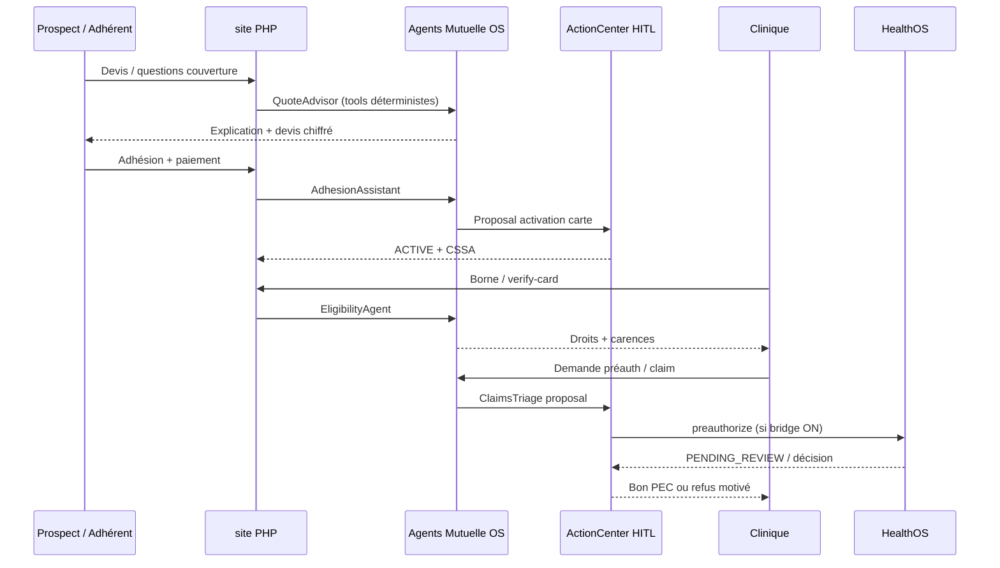

# PRD & Plan — MulemaCare Mutuelle Santé Full AI Agentic

> **Produit :** MulemaCare Health Group — mutuelle solidaire Afrique + diaspora  
> **Date :** 2026-08-30  
> **Statut :** Plan d’exécution (site PHP existant = fondation acquisition & ops)  
> **Canon design site :** Bio-Clinical Emerald (`#097268` / royal `#1E40AF` / gold `#D97706`) — pas Obsidian neon  
> **Offre chat diaspora (SKU) :** [`prd-mcare.md`](./prd-mcare.md) — **MCare**, interface type ChatGPT pour familles diaspora (pattern KijamiCare / Dr Benji)

---

## 1. Objectif business mesurable

Passer d’un **portail mutuelle opérationnel** (devis → adhésion → carte CSSA → tiers-payant) à une **mutuelle full AI agentic** où des agents préparent devis, adhésion, éligibilité, triage sinistres et desk partenaire, et où **toute décision financière / couverture / suspension passe par HITL** — sans casser le site PHP déjà en production.

**Volet commercial parallèle :** vendre **MCare** — chat type ChatGPT pour sponsors diaspora qui pilotent la santé de la famille au pays (détail offre, quotas, UX, API → [`prd-mcare.md`](./prd-mcare.md)).

**KPI nord :** délai médian « lead → carte CSSA active » < 15 min (parcours digital) ; **KPI ops :** ≤ 5 min médiane pour une pré-autorisation clinique assistée (agent + revue humaine) sur pilote HealthOS ; **KPI MCare :** ≥ 35 % adhérents diaspora actifs utilisent le chat ≥ 1× / mois.

---

## 2. Hypothèse de valeur + KPI

| Hypothèse | Preuve cible (90 j) |
|-----------|---------------------|
| Un agent de devis + adhésion augmente la conversion WhatsApp → paiement | +25 % taux devis enregistré → adhésion payée vs baseline site |
| Un agent de triage sinistres réduit la charge back-office | −40 % tickets manuels « est-ce couvert ? » |
| Bridge HealthOS + HITL préauth augmente la confiance réseau | ≥ 80 % préauths pilote traitées < 1 h ouvrée |
| MCare (chat diaspora) augmente conversion & rétention Silver+ | +20 % devis diaspora → paiement ; +15 % mix Silver+ |

---

## 3. État des lieux — ce qui est DÉJÀ fait dans `site/`

### 3.1 Portail & stack (refonte post-Laravel 5.6)

- Micro-framework **PHP 8 PSR-4** (`index.php` + `Router`) — cible perf IONOS, plus de Laravel/Voyager.
- Design system clinique clair (Outfit / Plus Jakarta Sans, émeraude).
- SEO / GEO : `robots.txt`, `sitemap.xml`, `llms.txt` / `llms-full.txt`.

### 3.2 Parcours métier exposés

| Surface | Route | Rôle |
|---------|-------|------|
| Hub écosystème | `/` | Mutuelle + Lisacare + Ongwa |
| Formules particuliers | `/mutuelle-sante` | Bronze → Platinium, XAF/EUR/USD |
| Entreprises / PME | `/entreprises` | Devis collectif |
| Réseau & annuaire | `/reseau-soins`, `/annuaire` | Cliniques tiers-payant |
| Partenaires | `/partenaires` | Conventionnement |
| Pays / diaspora | `/pays/{slug}`, `/diaspora/{slug}` | Couverture famille au pays |
| Devis & adhésion | `/devis`, `/adhesion` | Acquisition |
| Borne clinique | `/borne-clinique`, `/verifier` | Fast-check carte |
| Espace adhérent | `/espace-adherent` | Self-service (lookup) |
| Admin | `/admin`, `/espace-admin` | Statuts cartes |
| Carte | `/carte/{memberId}` | CSSA digitale / QR |

### 3.3 API déjà câblées

| Endpoint | Comportement |
|----------|----------------|
| `POST /api/quote` | Calcul + option save devis (particulier / corporate) |
| `POST /api/subscribe` | Adhésion + émission CSSA |
| `GET /api/verify-card/{code}` | Fast-check clinique |
| `GET /api/adherent/lookup` | Lookup adhérent |
| `POST /api/claim` | Bon de prise en charge |
| `POST /api/admin/toggle-status` | ACTIVE / suspend |
| `POST /api/webhook` | Webhook Stripe signé (`/api/stripe/webhook`) — ACTIVE après paiement |
| `POST /api/checkout` | Retry Checkout pour cssa_id PENDING |

### 3.4 Services & config métier

- `QuoteService` — grilles Solo/Couple/Famille, cycles mensuel/annuel, corporate.
- `MembershipService` — membres, ayants droit, carences, plafonds, claims (MySQL + fallback JSON).
- `config.php` — plans, Mobile Money (Orange / MTN), corporate FR/CM, écosystème Lisacare & Ongwa.
- Maquettes UX riches : `docs/adherent.html`, `docs/admin.html`.

### 3.5 Bridge HealthOS (prêt, OFF par défaut)

- Client `HealthOSClient` + doc `docs/HEALTHOS_BRIDGE.md`.
- Auth HMAC partenaire ; `eligibility` ; `preauthorize` → **toujours `PENDING_REVIEW`**.
- Feature flag `MULEMACARE_HEALTHOS_BRIDGE_ENABLED` — rollback = remettre `false`.

### 3.6 Gaps critiques avant « full agentic »

| Gap | Impact |
|-----|--------|
| **Aucun runtime agent / LLM / ActionCenter** | Pas encore de mutuelle agentic |
| Webhook paiement stub | Adhésion « validée » sans preuve de paiement fiable |
| Auth adhérent/admin faible (lookup / pas JWT) | Risque PII & fraude |
| Secrets DB en clair dans config / docs | Dette sécu urgente (rotation + env only) |
| Bridge HealthOS non activé | Pas de vérité clinique partagée |
| Mapping CSSA ↔ `patient_id` HealthOS absent | Prérequis activation bridge |
| Pas de RAG garanties / CG / carences | Agents inventeraient les plafonds |

---

## 4. Architecture minimale cible

```text
┌─────────────────────────────────────────────────────────────────┐
│  ACQUISITION & PARTENAIRES (CONSERVER)                          │
│  site/  PHP 8 PSR-4  ·  mulemacare.com  ·  IONOS                │
│  devis · adhésion · borne · SEO/llms · Mobile Money UI          │
└────────────────────────────┬────────────────────────────────────┘
                             │ HTTPS + HMAC / session
                             ▼
┌─────────────────────────────────────────────────────────────────┐
│  MUTUELLE OS (NOUVEAU — modular monolith FastAPI)               │
│  cybernecs/mulemacare-api                                       │
│  domain/ · services/ · repositories/ · api/                     │
│  Agents + ActionCenter HITL + audit + RBAC                      │
│  PostgreSQL (+ pgvector Knowledge Hub garanties)                │
│  Redis (jobs / nonces) · Ollama/vLLM ou HybridClient            │
└───────────────┬─────────────────────────────┬───────────────────┘
                │ partner bridge (existant)   │
                ▼                             ▼
        HealthOS (clinique)            Lisacare / Ongwa (liens)
```

### Principes non négociables

1. **Le site PHP reste la façade acquisition** jusqu’à preuve que Next.js apporte un KPI net — pas de big-bang rewrite.
2. **Les agents proposent, les humains (ou règles déterministes strictes) décident** pour paiement, couverture, suspension, préauth > seuil.
3. **Tenant / `tenant_id` depuis JWT** côté Mutuelle OS — jamais dans le body.
4. **PII santé** : chiffrement at-rest (Fernet ou équivalent), masquage affichage public, audit trail.
5. Images Docker : `cybernecs/mulemacare-api`, `cybernecs/mulemacare-web` (si console Next).

### Roster agents (MVP → scale)

| Agent | Job | HITL ? |
|-------|-----|--------|
| **QuoteAdvisor** | Explique formules, calcule via `QuoteService` contract, oriente Solo/Couple/Famille | Non si lecture seule ; Oui si remise / override tarif |
| **AdhesionAssistant** | Collecte ayants droit, carences, devises, canal paiement | Oui avant activation carte si paiement non confirmé |
| **EligibilityAgent** | Lit plafonds / carences / statut CSSA (+ HealthOS si bridge ON) | Non (lecture) |
| **ClaimsTriageAgent** | Classe PEC, détecte hors-garantie, propose accept/refuse/partiel | **Oui** (toujours) |
| **FraudWatchAgent** | Signaux doubles claims, plafonds, géo | **Oui** avant blocage |
| **PartnerDeskAgent** | Aide clinique (borne) : « couverture ? carence ? » | Non si FAQ ; Oui si préauth |
| **DiasporaCareNavigator** | Oriente pays / devise / WhatsApp desk | Non |
| **MCare (chat famille)** | Interface type ChatGPT sponsor diaspora — couverture, triage, réseau, transmit médecin/Lisacare | Transmit / préauth / geste financier → **Oui** (voir [`prd-mcare.md`](./prd-mcare.md)) |
| **Concilium 3 personas** | Litiges couverture / exceptions médicales | **Oui** + juge humain |

---

## 5. Risques + dette + sécurité

| Risque | Mitigation |
|--------|------------|
| Agent « approuve » un sinistre hors plafond | ActionCenter `pending` obligatoire ; moteur règles déterministes avant LLM |
| Fuite PII (santé) | Fernet, RLS tenant, pas de logs bruts ; pas d’ID HealthOS déduit d’un email |
| Double vérité site JSON vs Mutuelle OS | Source of truth progressive : MySQL/PG mutuelle ; site = client API |
| Secrets dans le repo | Rotation immédiate ; `getenv` only ; retirer secrets des docs |
| Bridge HealthOS mal mappé | Table de correspondance manuelle validée, tenant pilote, lecture d’abord |
| Rewrite FE trop tôt | Garder PHP acquisition ; Next seulement pour console agent/HITL |

---

## 6. Tradeoffs — Now / Later / Never

| Now | Later | Never |
|-----|-------|-------|
| **Stripe Checkout Subscription diaspora (EUR/USD)** — cash immédiat | Console Next adhérent/admin (remplace HTML maquettes) | Microservices claims/quote/auth séparés dès le jour 1 |
| Secrets env only + webhook signé | Activation bridge HealthOS préauth (après mapping) | Auto-approbation financière sans HITL |
| Mutuelle OS FastAPI + ActionCenter + 3 agents | Agent fraude + concilium litiges | Remplacer Lisacare/Ongwa par un chat générique |
| RAG garanties / carences / plafonds | Mobile Money auto-confirm (API MoMo) | Copier thème Obsidian neon / autre produit |
| Brancher site PHP → Mutuelle OS (feature flag) | Mobile app Expo | Diagnostic IA autonome / fake « N médecins online » |
| **MCare** chat diaspora (SKU + CTA `/diaspora/*`) | Voice / WhatsApp inbound MCare | ACTIVE carte sans paiement confirmé |

---

## 7. Plan d’exécution (8 jalons) + rollback

### J0 — Fondations sécu & **Stripe diaspora cash-first** (NOW)

1. Secrets hors repo (`DB_PASS`, clés Stripe via env) — voir `site/.env.example`.
2. **Stripe Checkout Subscription** EUR/USD : `PENDING_PAYMENT` → webhook signé → `ACTIVE`.
3. Doc ops : [`STRIPE_DIASPORA.md`](./STRIPE_DIASPORA.md) · board : [`sprint-board.md`](./sprint-board.md).
4. Mobile Money XAF reste PENDING + WhatsApp (pas d’ACTIVE fantôme).
5. **Rollback :** `STRIPE_ENABLED=false` ; activation manuelle admin.

### J1 — Mutuelle OS skeleton (5–7 j)

1. FastAPI modular monolith `cybernecs/mulemacare-api` : health/ready, auth JWT rôles `MEMBER|PARTNER|OPS|ADMIN`.
2. Repositories miroir des contrats PHP (`quote`, `membership`, `claim`).
3. OpenAPI + tests pytest contrat.
4. **Rollback :** site PHP continue solo (aucun appel OS).

### J2 — ActionCenter HITL (4–5 j)

1. Entités `AgentProposal` (`pending|approved|rejected|executed`).
2. UI ops minimale (peut démarrer sur admin PHP ou maquette `docs/admin.html` câblée).
3. Règle : claims, toggle status, préauth, remises → proposal.
4. **Rollback :** désactiver agents ; ops manuelle admin existante.

### J3 — Agents lecture seule (5 j)

1. QuoteAdvisor + EligibilityAgent + DiasporaCareNavigator.
2. Tools = appels déterministes (`QuoteService` / API) — LLM = narration, pas de calcul inventé.
3. RAG v1 : CG + grilles `config.php` indexées pgvector.
4. **Rollback :** chat OFF ; formulaires site inchangés.

### J4 — Câblage site → OS (4 j)

1. `ApiController` : proxy optionnel vers Mutuelle OS (`MULEMACARE_OS_URL`).
2. Garder fallback local JSON/MySQL si OS down (`fetchWithFallback` côté OS + PHP).
3. **Rollback :** flag OFF → comportement actuel 100 %.

### J5 — ClaimsTriageAgent + PartnerDesk (5–7 j)

1. Triage sinistre → proposal + justification + preuves (plafond restant, carence).
2. Borne clinique enrichie (éligibilité expliquée, pas inventée).
3. **Rollback :** `POST /api/claim` direct sans agent.

### J6 — Bridge HealthOS pilote (après mapping) (5 j)

1. Mapping CSSA ↔ patient_id validé (1 tenant).
2. Eligibility lecture seule en prod pilote.
3. Préauth = proposal HealthOS `PENDING_REVIEW` + miroir ActionCenter.
4. **Rollback :** `MULEMACARE_HEALTHOS_BRIDGE_ENABLED=false`.

### J7 — Console agentic polish (Later, 7–10 j)

1. Next.js console ops (thème Bio-Clinical, pas Obsidian).
2. Remplacer progressivement `espace-adherent` / `espace-admin` PHP.
3. GEO : enrichir `llms.txt` avec endpoints agent publics non sensibles.

### J8 — MCare chat diaspora (offre vendable) — en parallèle dès J3

Voir plan détaillé **MC0→MC5** dans [`prd-mcare.md`](./prd-mcare.md).

1. SKU Essential / Family / Concierge branchés sur plans Bronze→Platinium.
2. Chat SSE + tools mutuelle + ClinCard + quotas (pattern KijamiCare / Dr Benji).
3. CTA sur `/diaspora/{slug}` + host dans `/espace-adherent`.
4. Transmit → Lisacare / file médecin ; jamais diagnostic autonome.
5. **Rollback :** `mcare_enabled=false` ; CTAs retirés ; WhatsApp desk actuel.

---

## 8. Vérification cible

| Gate | Critère |
|------|---------|
| Site | Pages critiques 200 ; 0 bouton mort sur devis/adhésion/borne |
| API PHP | Smoke quote / subscribe / verify-card |
| Mutuelle OS | `GET /health` + `/ready` ; pytest contrats agents |
| HITL | Aucune exécution claim/status sans `approved` |
| Sécurité | 0 secret en clair ; PII masquée logs ; RBAC matrice testée |
| Bridge | Pilote lecture seule verte avant préauth |
| QA | `make qa-mulemacare` (à créer) — Triple Zéro |

---

## 9. Parcours utilisateur agentic (cible MVP)



---

## 10. DoD produit « mutuelle full AI agentic » (MVP)

- [ ] Paiement confirmé → carte CSSA active (plus de faux positif webhook).
- [ ] ≥ 3 agents live avec tools déterministes + RAG garanties.
- [ ] 100 % des actions financières / couverture via ActionCenter.
- [ ] Site PHP acquisition intact + flag OS.
- [ ] Bridge HealthOS documenté ; pilote lecture seule OU OFF explicite.
- [ ] Audit trail consultable admin.
- [ ] Aucun secret dans le dépôt.
- [ ] **MCare** vendable : SKU + chat tools-backed + transmit humain (DoD détaillé dans [`prd-mcare.md`](./prd-mcare.md)).

---

## Annexes

- **MCare (chat diaspora type ChatGPT) :** [`docs/prd-mcare.md`](./prd-mcare.md)
- Audit legacy → moderne : `docs/MULEMACARE_AUDIT_ET_REFONTE.md`
- Bridge : `docs/HEALTHOS_BRIDGE.md`
- Stripe diaspora : `docs/STRIPE_DIASPORA.md` · Sprint board : `docs/sprint-board.md`
- Maquettes : `docs/adherent.html`, `docs/admin.html`
- Référence pattern sœur : `APPS/PUBLIC/HEALTH/KIJAMICARE` (Dr Benji) — réutiliser FSM/quotas/ClinCard, **pas** la marque ni le thème
